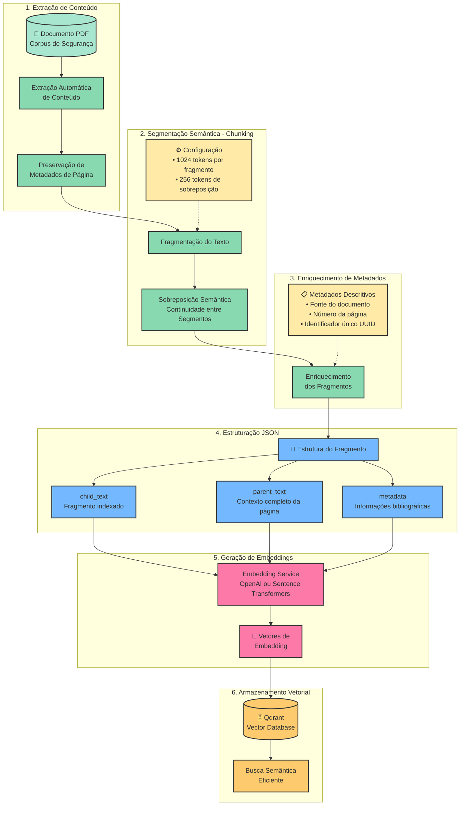
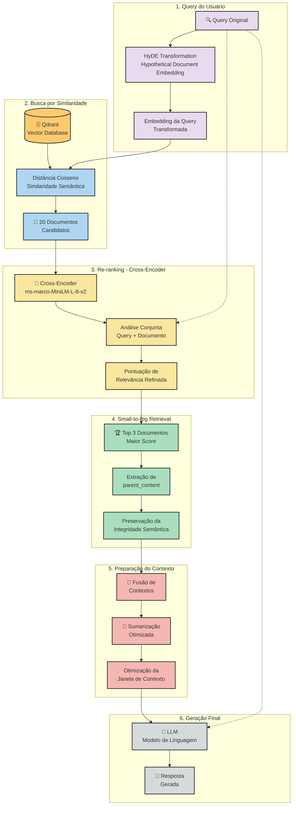

graph TB
    subgraph "Frontend - React"
        UI[Interface de Usuário React]
    end
    
    subgraph "PhishForge API - Arquitetura RAG"
        subgraph "API Layer"
            Router[API Router]
            Endpoints[Endpoints v1]
        end
        
        subgraph "Core Services - Pipeline RAG"
            DocProc[Document Processor Processador de Documentos]
            Embed[Embedding Service Gerador de Embeddings OpenAI/Sentence Transformers]
            Ret[Retriever Recuperador de Documentos]
            Rerank[Reranker Reordenação de Resultados]
            Gen[Response Generator Gerador de Respostas]
            PromptNorm[Prompt Normalizer Normalização de Prompts]
        end
        
        subgraph "Domain Layer"
            PhishService[Phishing Service]
            EvalService[Evaluation Service]
            Models[Domain Models]
        end
        
        subgraph "Infrastructure Layer"
            Qdrant[(Qdrant Vector Store)]
            Postgres[(PostgreSQL Database)]
            Repos[Repositories Analytics, Evaluation, Phishing]
        end
    end
    
    %% Fluxo Principal
    UI -->|HTTP Request| Router
    Router --> Endpoints
    Endpoints --> PhishService
    
    %% Pipeline RAG
    PhishService --> DocProc
    DocProc --> Embed
    Embed --> Qdrant
    PhishService --> Ret
    Ret --> Qdrant
    Ret --> Rerank
    Rerank --> Gen
    PromptNorm --> Gen
    
    %% Persistência
    PhishService --> Repos
    EvalService --> Repos
    Repos --> Postgres
    
    %% Response
    Gen -->|Phishing Example| PhishService
    PhishService -->|JSON Response| Endpoints
    Endpoints -->|HTTP Response| UI
    
    %% Estilos
    classDef frontend fill:#61dafb,stroke:#333,stroke-width:2px,color:#000
    classDef api fill:#00d084,stroke:#333,stroke-width:2px
    classDef service fill:#ff6b6b,stroke:#333,stroke-width:2px
    classDef infra fill:#4ecdc4,stroke:#333,stroke-width:2px
    classDef storage fill:#ffe66d,stroke:#333,stroke-width:2px
    
    class UI frontend
    class Router,Endpoints api
    class DocProc,Embed,Ret,Rerank,Gen,PromptNorm,PhishService,EvalService service
    class Repos infra
    class Qdrant,Postgres storage

## Pipeline de Processamento de Documentos

## Sistema de Recuperação e Re-ranking

## Corpus de Documentos - Base de Conhecimento

| # | Arquivo | Título/Descrição | Tipo |
|---|---------|------------------|------|
| 1 | 1705.09819v1.pdf | Artigo Científico arXiv (1705.09819) | Artigo Acadêmico |
| 2 | Counterintelligence_Tips_Spearphishing.pdf | Counterintelligence Tips: Spearphishing | Guia Técnico |
| 3 | Gamification_Techniques_for_Raising_Cyber_Security.pdf | Gamification Techniques for Raising Cyber Security Awareness | Artigo Acadêmico |
| 4 | Integrating-self-efficacy-into-a-gamified-approach.pdf | Integrating Self-Efficacy into a Gamified Approach | Artigo Acadêmico |
| 5 | L-G-0000568657-0002356793.pdf | Documento Técnico (L-G-0000568657) | Documento Técnico |
| 6 | Phishing-Attacks-Guide.pdf | Phishing Attacks Guide | Guia Técnico |
| 7 | Phishing.pdf | Phishing - Documento Geral | Material Educativo |
| 8 | Ratcliff IT - Top 10 types of phishing scams eBook.pdf | Top 10 Types of Phishing Scams eBook | eBook |
| 9 | Teaching_Phishing-Security_Which_Way_is_Best.pdf | Teaching Phishing Security: Which Way is Best? | Artigo Acadêmico |
| 10 | VWCardoso.pdf | Trabalho Acadêmico - VW Cardoso | Trabalho Acadêmico |
| 11 | apwg_trends_report_q1_2025.pdf | APWG Phishing Trends Report Q1 2025 | Relatório Estatístico |
| 12 | chi2019_whathack.pdf | CHI 2019 - What Hack | Artigo Acadêmico |
| 13 | eg-guide-on-phishing.pdf | EG Guide on Phishing | Guia Técnico |
| 14 | phishing-awareness-ppt.pdf | Phishing Awareness Presentation | Apresentação |
